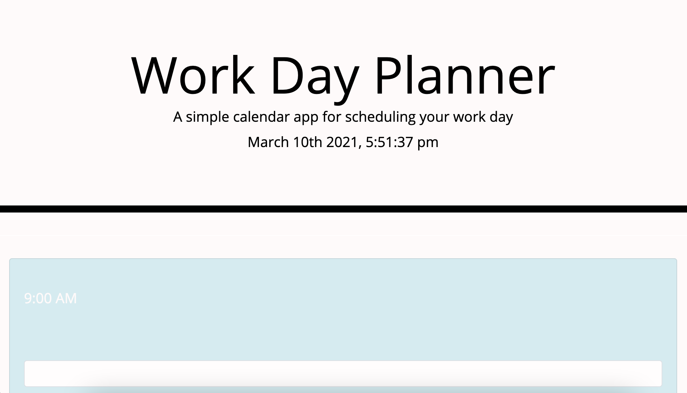
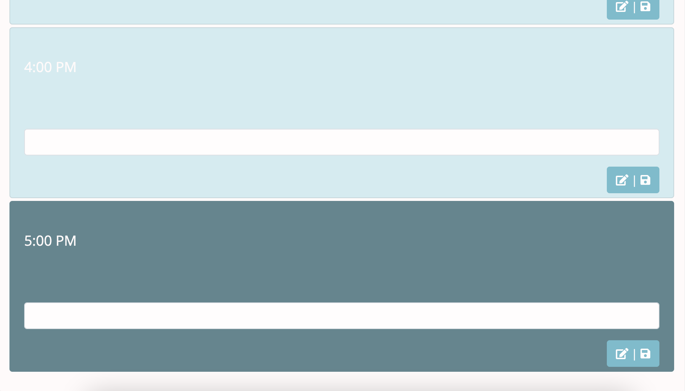

# Work Day Planner

## Description

The page is a primer for an HTML body filled with time blocks ranging between a typical 9-5 work day. Each individual block is an hour interval, where the user can enter inputs, designating each block for an activity, routine, or goal. Entry is stored and saved in local storage until the user edits the block and resaves.

Using Moment.js, the current day is relayed to the header as a point of reference for the subjective user. The current hour is used to highlight the present time block, while others are left inactive until current.

## Ideal User/User Story

```
AS AN employee with a busy schedule
I WANT to add important events to a daily planner
SO THAT I can manage my time effectively
```

## Screenshots

The following screenshot demonstrates the current day relay in the page header:



The following is a demonstration of the highlighted time block on the current hour using Moment.js:

